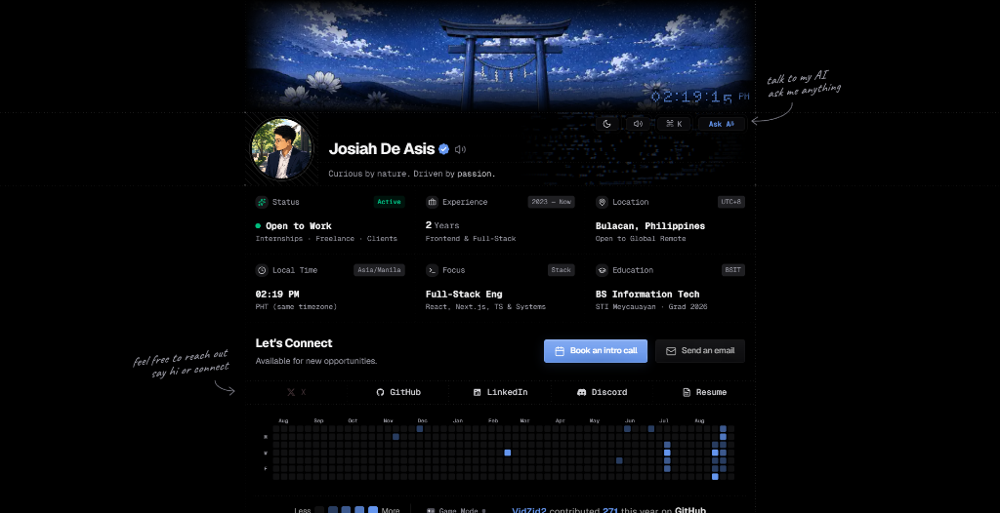

# Project SYNC (Portfolio v2.0)
**An interactive developer portfolio, technical blueprint UI system, and creative web platform.**

 

&nbsp;

 

A high-performance technical blueprint developer portfolio built from scratch to showcase my work as a Frontend Engineer & 2nd-Year BSIT Student.

→ **Live site:** [sync-portfolio-jd.vercel.app](https://sync-portfolio-jd.vercel.app)

 

  

---

## Overview

### Stack

* **Framework:** Next.js 16 (App Router & Turbopack)
* **Library:** React 19
* **Language:** TypeScript
* **Styling:** Tailwind CSS v4
* **Motion & Physics:** Framer Motion
* **Audio Feedback:** Native Web Audio API Synthesis
* **AI Integration:** Google Gemini AI API & Vercel AI SDK
* **Deployment:** Vercel

### Featured Capabilities

* **Blueprint Layout Architecture:** Custom dynamic dot-grid masks and structural technical borders.
* **WebGL Profile Reveal:** Custom GLSL vertex & fragment shaders revealing photo textures under the cursor.
* **Procedural Sound Engine:** Web Audio API synth generator providing zero-latency acoustic UI feedback.
* **Real-time AI Assistant:** Server-sent token streaming powered by Google Gemini AI with interactive suggestions.
* **2D Spring Curved Physics:** Bezier curve trajectory flight indicators on carousels and milestone bullets.
* **Pure CSS Theme System:** Zero-flicker light and dark mode switching with strict SSR hydration safety.
* **Mobile Budgeting:** Strict sub-50ms latency targets and responsive touch gesture controls.
* **SEO & OpenGraph:** Fully optimized metadata, robots, sitemap, and dynamic link previews.

---

## Key Systems

### 1. Blueprint Matrix Grid
The layout utilizes responsive SVG and CSS linear gradient masks (`DOT_MASK_HORIZONTAL`, `DOT_MASK_VERTICAL`) ensuring crisp alignment on any viewport width.

### 2. Audio Synthesis (`synth-sounds.ts`)
Rather than loading heavy `.mp3` audio assets, all user interaction sound effects (hover ticks, soft clicks, modal pops) are procedurally synthesized in real time via the browser's native `AudioContext`.

### 3. Profile Cursor Shaders (`profile-reveal/`)
Desktop cursor hover drives dynamic particle dispersion and texture blending between avatar states via WebGL framebuffers.

---

## License

This repository is licensed under the [MIT License](LICENSE).

Feel free to fork this project, learn from the architecture, or use it as inspiration for your own builds. If you do, kindly swap out my personal details, branding, and assets before publishing!

---

## Connect

* **Website:** [sync-portfolio-jd.vercel.app](https://sync-portfolio-jd.vercel.app)
* **Contact Form:** [sync-portfolio-jd.vercel.app/contact](https://sync-portfolio-jd.vercel.app/contact)
* **Email:** [josiahdeasis009@gmail.com](mailto:josiahdeasis009@gmail.com)
